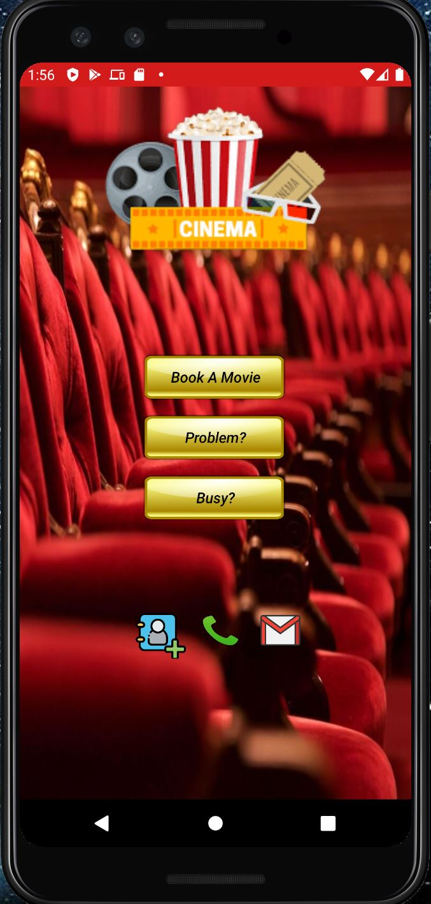
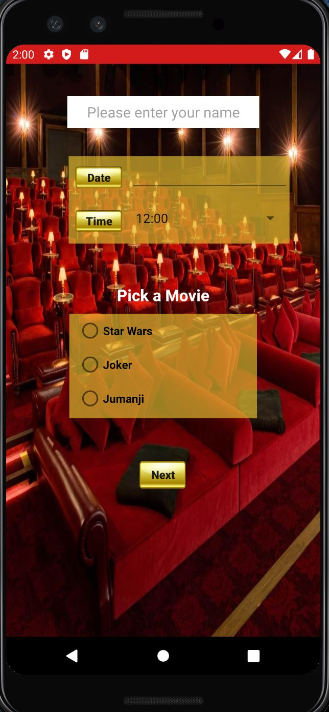
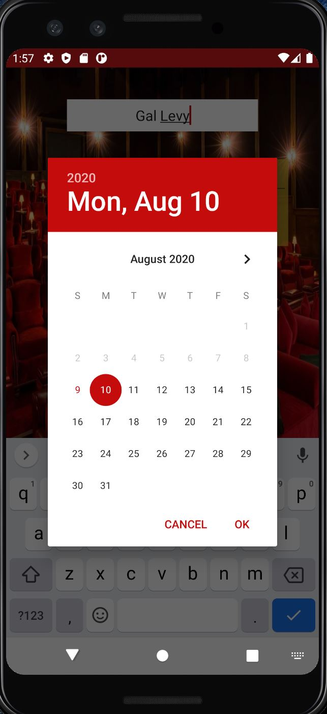
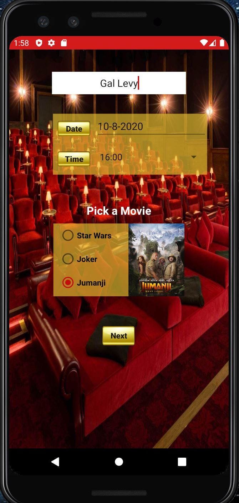
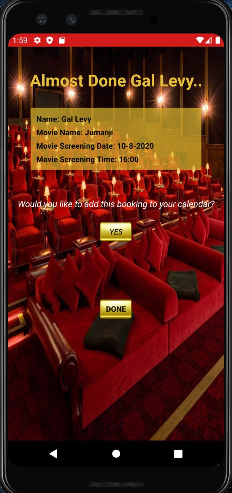
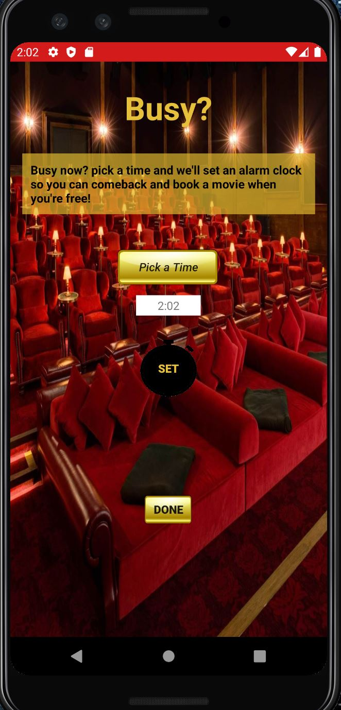

# Cinema
An android application, using Android Studio written in Java. 

Developed as part of an Android course. 

The app provides a simple user interface, which allows you to book a movie, pick a time and a date, 
select the desired movie and even adding the booking time and date to your calendar. 
You can also set an alarm clock to remind yourself to come back later and complete the booking. 
And you can even upload a picture or a video if you want to file a complaint.   

# Screenshots:

